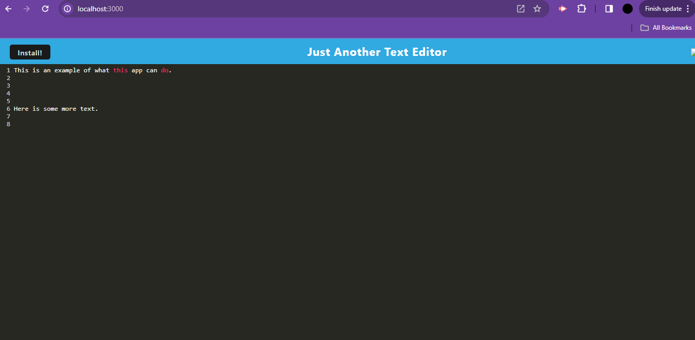
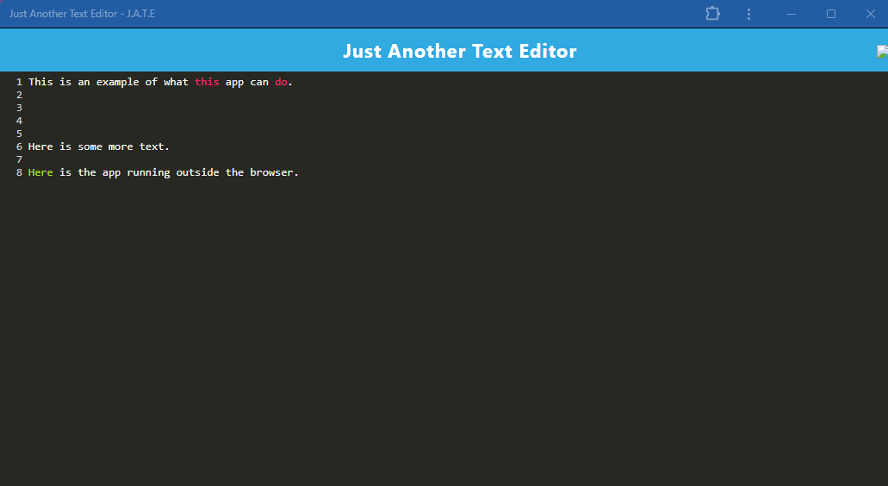

   # Text Editor
   

   ## Description
   
   This is a text editor application where you can edit your text to your hearts content. It is also designed to work offline if you are not connected to the internet.
   
   ## Table of Contents 
   
   1. [Installation](#installation)
   2. [Usage](#usage)
   3. [License](#license)
   4. [How to Contribute](#how-to-contribute)
   5. [Tests](#tests)
   6. [Questions](#questions)
   
   ## Installation
   
   N/A
   
   ## Usage

   Deployment: https://text-editor-kii2.onrender.com/
   
   Simply type. That is all. The sky is the limit. When you are ready to view it offline, click on "Install!" and it will open a window and keep the text you already typed.

   

   
   
   ## License
   
   MIT

   ## Tests

   N/A

   ## Questions

   For any additional questions, please contact me:
   github.com/GwiyomiAmy